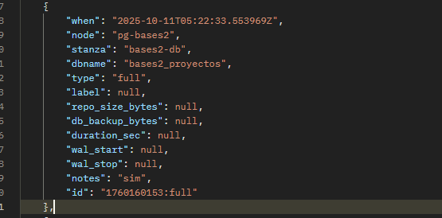
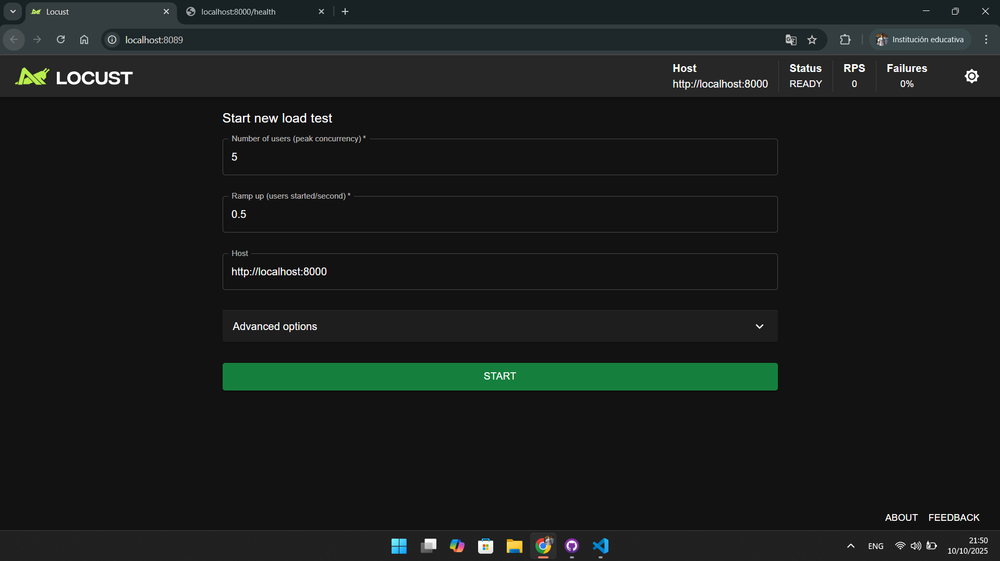
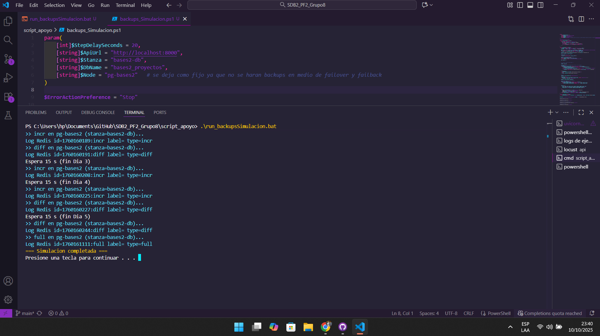

# Capturas de backups, hay las ordenas dukin

Validacion de que la api esta funcionando correctamente y conectada a la DB

Ejecucion del script de automatizacion de los backups

docker exec -u postgres pg-bases2 pgbackrest --stanza=bases2-db info

## Primer Backup (Dia 1 - Completo)
En este caso se hizo un completo sin ningun cambio, osea el apartado de locust esta apagado, cosa que no manda nuevos datos

Informacion de Redis

Informacion dentro del contenedor

## Segundo Backup (Dia 2 - Incremental)

En este caso ya encendemos Locust para generar datos, buscando que ya vean diferencias en los backups, a partir de aca Locust siempre estara encendido mandando datos con los mismos parametros, los siguientes backups seran asi.

Informacion de Redis

Informacion dentro del contenedor

## Tercer Backup (Dia 3 - Incremental, Diferencial)

Informacion de Redis

Informacion dentro del contenedor

## Cuarto Backup (Dia 4 - Incremental)

Informacion de Redis

Informacion dentro del contenedor

## Quinto Backup (Dia 5 - Incremental, Diferencial)

Informacion de Redis

Informacion dentro del contenedor

## Sexto Backup (Dia 6 - Diferencial, Completo)
En este caso aqui, finalmente si se apaga el locust al momento de hacer el ultimo completo

Informacion de Redis

Informacion dentro del contenedor

### Script finalizado
